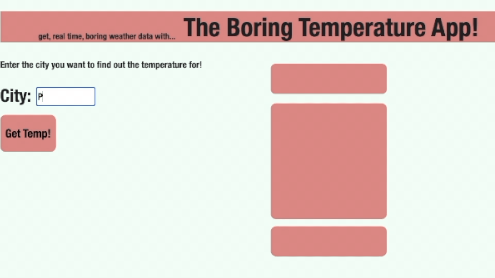
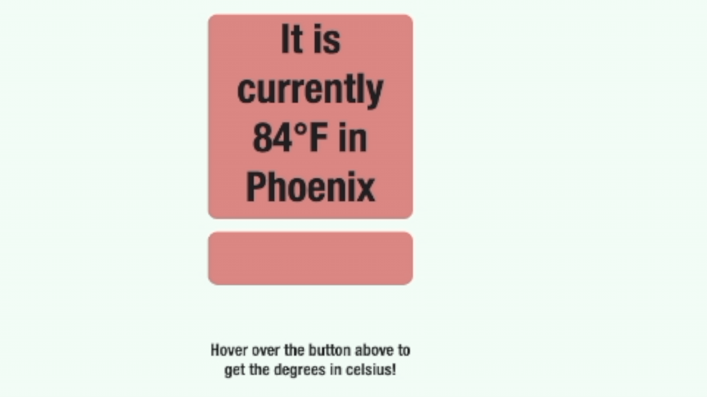
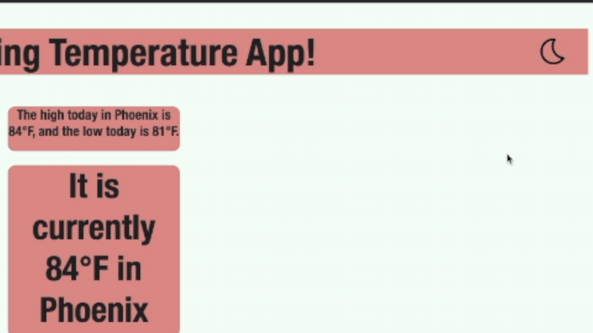

# Thank you for using The Boring Temperature App!

The Boring Temperature App is used to get the temperature for most cities in the world! 

In addition to getting the current temperature in fahrenheit, as well as the daily highs and lows, The Boring Temperature App can be used to also get the temperature data returned to you in celsius!

# Features

Get the current weather from the Open Wheater Map API!

As well as that same weather in celsius!

Check out dark mode!

# Video Link!

https://www.youtube.com/watch?v=iESg8S4qK20

# Usage and access

The Boring Temperature app can be used by simply forking and copy the files into your directory from github and then by opening the ProBlam.html in your browser. 

Feel free to contact me with any further questions concerning The Boring Temperature App                @Bobby.deluna2@gmail.com

# Credit

The Boring Temperature App designed and created by Bobby De Luna for Final Project for Phase 1 in the Software Engineering program from Flatiron School. 

The Boring Temperature App uses the OpenWeatherMap.org API. 

